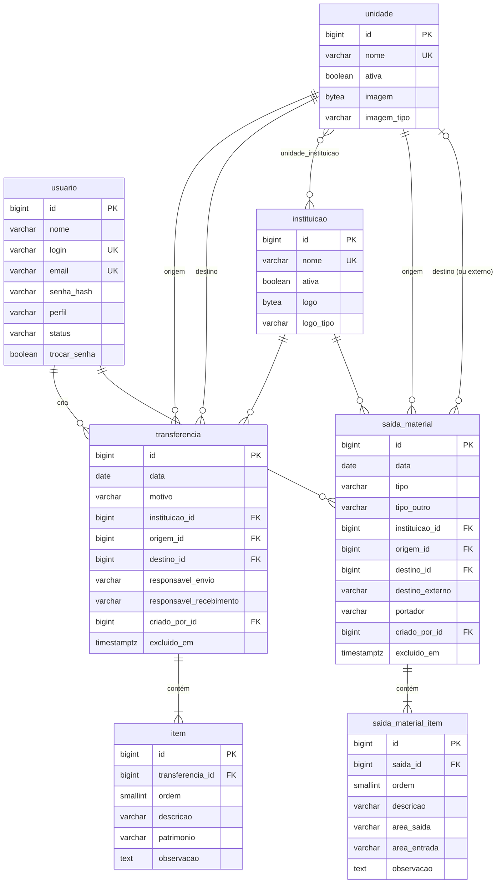

# Modelo de dados

O schema oficial é definido pelas migrações Flyway em [`db/migration`](../src/main/resources/db/migration):

| Versão | Conteúdo |
|---|---|
| V1 | Schema inicial |
| V2 | Logo da instituição guardada no banco; coluna antiga da foto da unidade removida ([D-023](decisoes.md)) |
| V3 | Foto da unidade guardada no banco ([D-031](decisoes.md)) |
| V4 | Bloqueio de instituição (`ativa`) ([D-033](decisoes.md)) |
| V5 | Bloqueio de unidade (`ativa`); usuários excluídos com transferências passam a bloqueados ([D-035](decisoes.md)) |
| V6 | Controle de Saída de Materiais: `saida_material` e `saida_material_item` ([D-044](decisoes.md)) |

O modelo tem 8 tabelas (6 do termo de transferência e 2 do controle de saída de materiais). O banco antigo tinha 16: 8 eram infraestrutura do Laravel e 3 eram do pacote de permissões *spatie*.

## Tabelas

### `usuario`

| Coluna | Tipo | Observação |
|---|---|---|
| `id` | bigint | identidade |
| `nome` | varchar(150) | |
| `login` | varchar(100) | único, sem diferenciar maiúsculas |
| `email` | varchar(150) | único, sem diferenciar maiúsculas |
| `senha_hash` | varchar(100) | BCrypt; os hashes `$2y$` do Laravel são aceitos |
| `perfil` | varchar(20) | `LEITOR`, `TECNICO`, `ADMIN`, `SUPERADMIN` (ver [perfis-e-permissoes.md](perfis-e-permissoes.md)) |
| `status` | varchar(20) | `ATIVO`, `BLOQUEADO`, `EXCLUIDO`. `EXCLUIDO` (lixeira) só para quem nunca criou transferências nem saídas de materiais |
| `trocar_senha` | boolean | obriga a trocar a senha no próximo acesso (primeiro login ou senha redefinida por admin) |
| `criado_em`, `atualizado_em` | timestamptz | |

### `instituicao`

| Coluna | Tipo | Observação |
|---|---|---|
| `id` | bigint | |
| `nome` | varchar(50) | único (SESI, SENAI), em maiúsculas |
| `ativa` | boolean | `false` = bloqueada para novas transferências. Instituições já usadas não são excluídas, são bloqueadas |
| `logo` | bytea | imagem da logo impressa no termo (PNG ou JPEG, até 1 MB); enviada pela API |
| `logo_tipo` | varchar(30) | `image/png` ou `image/jpeg`; preenchido junto com `logo` (restrição `ck_instituicao_logo`) |

### `unidade`

| Coluna | Tipo | Observação |
|---|---|---|
| `id` | bigint | |
| `nome` | varchar(100) | único (SEDE, CETAF-AJU, …), em maiúsculas |
| `ativa` | boolean | `false` = bloqueada para novas transferências. Unidades já usadas não são excluídas, são bloqueadas |
| `imagem` | bytea | foto da unidade exibida nos cartões das transferências; sempre JPEG de até 1200 px, redimensionado no upload |
| `imagem_tipo` | varchar(30) | `image/jpeg`; preenchido junto com `imagem` (restrição `ck_unidade_imagem`) |

### `unidade_instituicao`

Associação N:N que informa quais unidades pertencem a cada instituição. Serve para filtrar as unidades no formulário. A chave primária é `(unidade_id, instituicao_id)`.

### `transferencia`

| Coluna | Tipo | Observação |
|---|---|---|
| `id` | bigint | **mesmo número do sistema antigo** (os termos impressos continuam válidos) |
| `data` | date | data da transferência informada pelo usuário |
| `motivo` | varchar(30) | enum, ver abaixo |
| `instituicao_id` | FK `instituicao` | |
| `origem_id` | FK `unidade` | unidade remetente |
| `destino_id` | FK `unidade` | unidade destinatária |
| `responsavel_envio` | varchar(150) | nome livre (não é usuário do sistema) |
| `responsavel_recebimento` | varchar(150) | nome livre |
| `criado_por_id` | FK `usuario` | dono da transferência |
| `criado_em`, `atualizado_em` | timestamptz | |
| `excluido_em` | timestamptz | preenchido quando está na lixeira |

**Motivos** (enum no código; o tipo define em que quadro aparece o "X" no termo):

| Valor | Texto no termo | Tipo |
|---|---|---|
| `TRANSFERENCIA_ENTRE_FILIAIS` | Transferência entre filiais | Definitiva |
| `BAIXA_DESCARTE` | Baixa / Descarte | Definitiva |
| `MANUTENCAO` | Manutenção | Temporária |
| `EMPRESTIMO_TEMPORARIO` | Empréstimo temporário | Temporária |

### `item`

| Coluna | Tipo | Observação |
|---|---|---|
| `id` | bigint | mesmo ID do sistema antigo |
| `transferencia_id` | FK `transferencia` | `ON DELETE CASCADE` |
| `ordem` | smallint | número do item no termo (1, 2, 3…) |
| `descricao` | varchar(200) | |
| `patrimonio` | varchar(150) | `NULL` = sem patrimônio (aparece como "S/P"). Texto livre: alguns itens antigos têm vários números ou um número de série |
| `observacao` | text | |

### `saida_material`

Controle de Saída de Materiais da Unidade (formulário FM-072-UOP-04). É uma modalidade mais simples que o termo de transferência: sem responsáveis de envio e recebimento e **sem patrimônio nos itens**, porque são materiais não patrimoniados. Tem numeração própria.

| Coluna | Tipo | Observação |
|---|---|---|
| `id` | bigint | número da saída (sequência própria, separada da das transferências) |
| `data` | date | |
| `tipo` | varchar(20) | `PERMANENTE`, `TEMPORARIO`, `MANUTENCAO`, `EVENTO` ou `OUTRO` (os quadros do formulário) |
| `tipo_outro` | varchar(150) | "Outro, qual: …". Preenchido **se e somente se** `tipo = OUTRO` (restrição `ck_saida_tipo_outro`) |
| `instituicao_id` | FK `instituicao` | |
| `origem_id` | FK `unidade` | "DE" |
| `destino_id` | FK `unidade`, opcional | "PARA" quando o destino é uma unidade |
| `destino_externo` | varchar(200), opcional | "PARA" quando o material sai da instituição (assistência técnica, local de evento). **Exatamente um** entre `destino_id` e `destino_externo` (restrição `ck_saida_destino`) |
| `portador` | varchar(150), opcional | nome impresso sob a linha "Assinatura do Portador do Equipamento" |
| `criado_por_id` | FK `usuario` | |
| `criado_em`, `atualizado_em` | timestamptz | |
| `excluido_em` | timestamptz | preenchido = na lixeira |

### `saida_material_item`

| Coluna | Tipo | Observação |
|---|---|---|
| `id` | bigint | |
| `saida_id` | FK `saida_material` | `ON DELETE CASCADE` |
| `ordem` | smallint | número do item no formulário |
| `descricao` | varchar(200) | |
| `area_saida` | varchar(150) | setor, oficina ou laboratório de onde o material sai |
| `area_entrada` | varchar(150) | setor, oficina ou laboratório para onde vai |
| `observacao` | text | no temporário, a data prevista de retorno |

## Correspondência com o banco antigo

| Antigo (MySQL) | Novo | Transformação |
|---|---|---|
| `users` | `usuario` | `user_name` → `login`; e-mail em minúsculas |
| `model_has_permissions` + `permissions` | `usuario.perfil` | maior permission do usuário: superadministrador → SUPERADMIN, administrador → ADMIN, técnico → TECNICO, usuário/nenhuma → LEITOR |
| `users.is_blocked`, `users.deleted_at` | `usuario.status` | excluído **com** saídas → `BLOQUEADO` (D-035); excluído sem saídas → `EXCLUIDO`; bloqueado → `BLOQUEADO`; senão `ATIVO` |
| `users.is_first_login`, `is_password_reset_by_adm` | `usuario.trocar_senha` | verdadeiro se nunca logou ou se a senha foi redefinida por admin |
| `instituicoes` + arquivos `public/img/instituicao/*.png` | `instituicao` | a logo é lida do arquivo e gravada em `logo` |
| `unidades` + arquivos `public/img/unidades/*` | `unidade` | a foto é lida do arquivo, redimensionada (JPEG de até 1200 px) e gravada em `imagem` ([D-031](decisoes.md)) |
| `unidades_instituicoes` | `unidade_instituicao` | sem id e timestamps próprios |
| `saidas` | `transferencia` | `remetente_id` → `origem_id`, `destinatario_id` → `destino_id`, `user_id` → `criado_por_id`, `deleted_at` → `excluido_em`; `data_saida` (timestamp UTC) → `data` (date, fuso America/Sao_Paulo) |
| `motivos` | enum `motivo` | ids 1–4 → valores do enum |
| `itens` | `item` | `s/p` → `NULL`; `ordem` calculada por transferência; `\r\n` → `\n` |

Itens e colunas que **não foram migrados**:

| Removido | Motivo |
|---|---|
| `saidas.is_confirmed` | nunca usado pelo sistema |
| `itens.fk_user_id` | redundante: o dono vem da transferência |
| `users.two_factor_*`, `guid`, `domain`, `remember_token`, `email_verified_at` | não usados (o LDAP estava desativado) |
| `migrations`, `failed_jobs`, `personal_access_tokens`, `password_reset_tokens`, `roles`, `model_has_roles`, `role_has_permissions` | infraestrutura do Laravel ou tabelas vazias |
